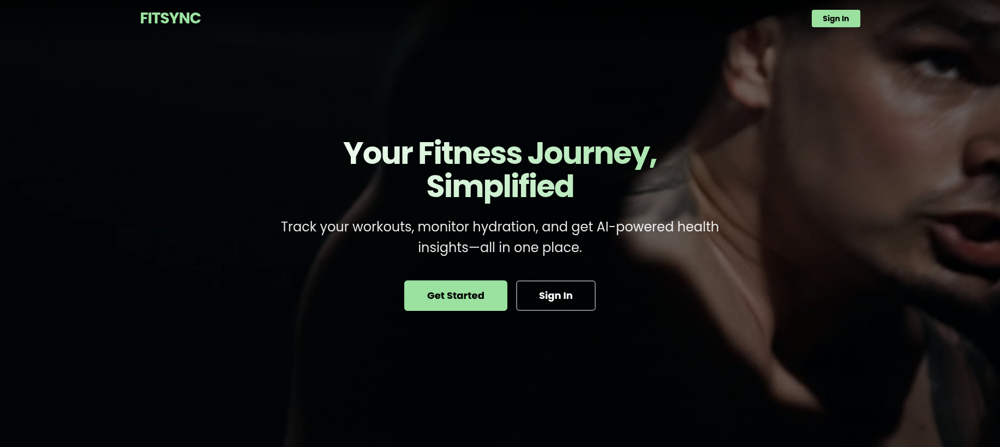
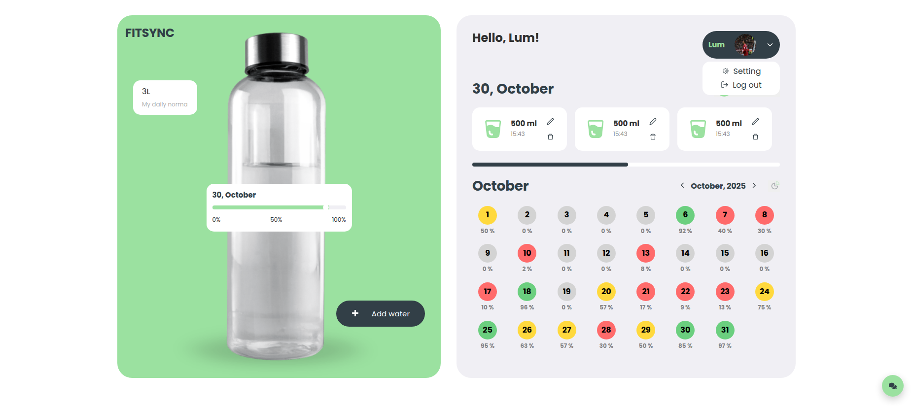
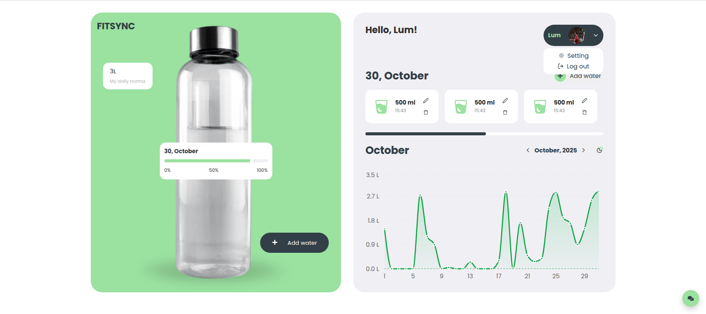
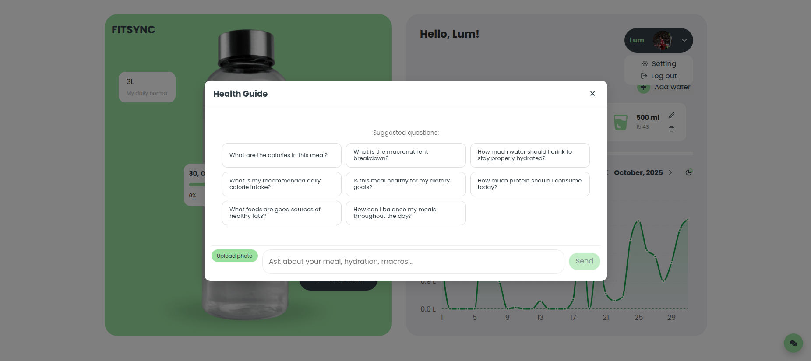

# FitSync

FitSync is an AI-powered fitness application designed to synchronize your health data and provide intelligent insights using the Google Gemini API.

---

## 📖 Table of Contents
- About the Project
  - Screenshots
- Key Features
- Tech Stack
- API Documentation
- Getting Started
  - Prerequisites
  - Backend Installation
  - Frontend Installation
- Deployment
- Security
- Contributing
- Repositories

---

## 🧐 About the Project

FitSync bridges the gap between raw fitness data and actionable health advice.  
By leveraging Google's Gemini AI, FitSync analyzes user metrics and provides personalized workout and nutrition recommendations.

- **Target Audience:** Fitness enthusiasts looking for AI-driven insights  
- **Goal:** Deliver a seamless interface for tracking and improving health metrics  

### 📸 Screenshots

**Landing Page**


**Water Tracking**


**Analytics & Charts**


**AI Health Chat Assistant**


---

## ✨ Key Features

- **AI Integration:** Smart health insights via Google’s Gemini API  
- **Secure Authentication:** Robust JWT-based authentication  
- **Interactive UI:** Fast, reactive frontend built with React + Vite  
- **Real-time Data Storage:** MongoDB with persistent user activity tracking  
- **Email Notifications:** Automated alerts via SendGrid  
- **Scalable Architecture:** MERN stack with clean separation of concerns  

---

## 🛠 Tech Stack

### Backend
- Runtime: Node.js v22  
- Framework: Express.js  
- Database: MongoDB (Mongoose ODM)  
- AI: Google Gemini API  
- Documentation: Swagger / OpenAPI  
- Utilities: Joi, Multer, SendGrid  

### Frontend
- Framework: React.js  
- Build Tool: Vite  
- State Management: Redux Toolkit  
- HTTP Client: Axios  
- Styling: CSS3 (with modern-normalize)  
- Validation: Yup  

---

## 📡 API Documentation

The backend API is fully documented using Swagger (OpenAPI).

👉 **Live API Docs:** https://fitsync.hordiyevskyy.com/api/docs/

Use the interface to:
- View all endpoints  
- Test requests  
- Understand response structures (200, 400, 500)  

---

## 🚀 Getting Started

### Prerequisites
- Node.js v22+ → `node --version`  
- MongoDB (local or MongoDB Atlas)  
- Gemini API Key  
- Git installed  

---

### Backend Installation

> **Note:** For backend installation instructions, see the [FitSyncBack repository](https://github.com/slonic32/FitSyncBack).

---

### Frontend Installation

#### 1. Clone the repository

```bash
git clone https://github.com/slonic32/FitSyncFront.git
cd FitSyncFront
```

#### 2. Install dependencies

```bash
npm install
```

#### 3. Run the application

- Development:

```bash
npm run dev
```

- Production preview:

```bash
npm run build
npm run preview
```

> ⚠️ Make sure the backend is running first.

### ☁️ Deployment

- **Recommended hosting:** Vercel
- **Setup:** Push frontend repo to GitHub, import to Vercel, deploy (automatic CI/CD)
- **Note:** Make sure the backend is running and accessible before deploying

### 🔒 Security
- Always use HTTPS in production
- Rotate API keys and JWT secrets regularly
- Restrict access to sensitive admin routes
- Keep dependencies updated

### 🤝 Contributing
1. Fork the project
2. Create a feature branch:

```bash
git checkout -b feature/AmazingFeature
```

3. Commit your changes:

```bash
git commit -m "Add AmazingFeature"
```

4. Push the branch:

```bash
git push origin feature/AmazingFeature
```

5. Open a pull request

### Repositories
- Backend Repository: https://github.com/slonic32/FitSyncBack
- Frontend Repository: https://github.com/slonic32/FitSyncFront
